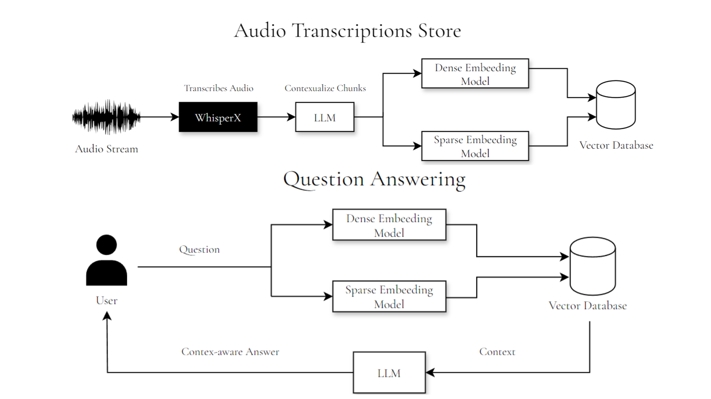

# meetAI

meetAI is a realtime meeting assistant where it transcribes audio in realtime, using transciptions to answer any relevant question by providing suitable context to LLMs.


# Features

- Realtime audio streaming and transcription using WhisperX
- Storage of transcriptions in a vector database for retrieval
- Contextual Retrieval: Enhancing the relevance of chunks by using LLMs to contextualize the current chunk within transcription history
- Fast, relevant search over meeting content supporting hybrid search (semantic + lexical)


# Architecture




# Installation

- Make a virtual enviroment and activate it
- Install requirements ```pip install -r requirements.txt``` and then inside frontend ```npm i```
- Run Qdrant Docker Image ```docker run -p 6333:6333 -p 6334:6334 -v "$(pwd)/qdrant_storage:/qdrant/storage:z" qdrant/qdrant```
- Make two terminals inside the folders frontend and backend
- Make .env file by ```mv .env.example .env``` and fill in API Keys
- Run backend by ```uvicorn main:app --port 8000 --reload```
- Run fronend by ```npm run dev```
- Open ```http://127.0.0.1:8501``` in your browser